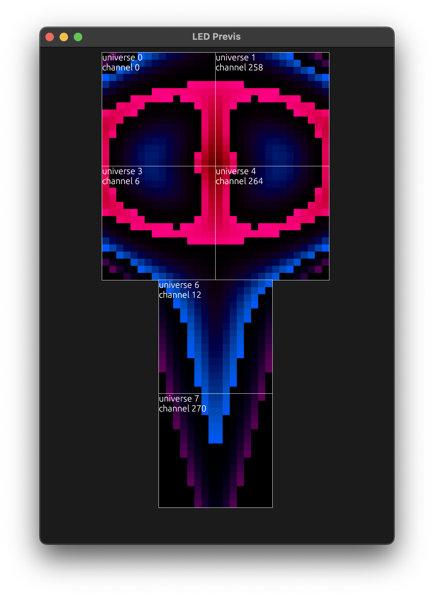

# Artnet Led Matrix Controller & Previsualizer
This project turns a bunch of WS2812 matrixes running off a raspberry pi into a reactive robot mouth.

<!--  -->


## Features
- Previs UI
- Structs to manage led matrix mappings
- Logic to properly structure led matrix mapping data to artnet
- Image generation


## Usage
- [Install the rust toolchain](https://www.rust-lang.org/tools/install)
- Update the networks constants at the top of main.rs
- Update the mappings in main.rs
- Execute '```Cargo run```'

## Technology
Rust is the programming language

I use a variety of libraries to support the serialization, color and vector math, visible in Cargo.toml.

## Help!
https://wiki.linuxaudio.org/wiki/raspberrypi
